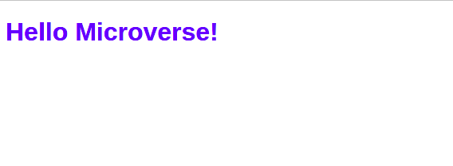

## Hello World Project Documentation

I this project I:

- Set-up linters for HTML and CSS files.
  -Set-up linters in the local environnement.
  -Create HTML and file in which I put an h1 tag.
  -I make a style for h1 tag in a css file.
  

## Built With

- HTML and CSS
  -VSCode

## Authors

- GitHub: [@nmeziany][https://github.com/nmeziany/portfolioskeleton]
- linkedIn: [https://www.linkedin.com/in/noureddine-meziany/]
